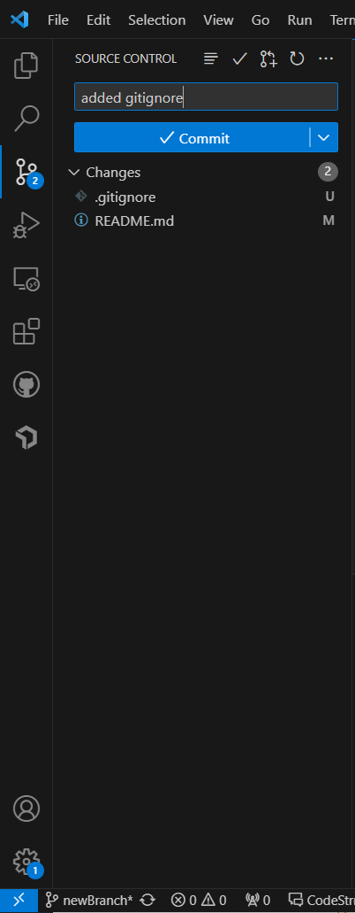

# Hi, my name is Ibraheem
## I'm a junior CS major at UC San Diego studying Computer Science
### I'm a big UFC and NBA fan
I transferred here from the bay area. I ~~live in Boston~~ live in the Bay Area and have spent most of my childhood there.<br>
One of my favorite quotes is <br>
>
> Desires make slaves out of kings and patience makes kings out of slaves – Al-Ghazali
> 
Below is a hello world function in c++ <br>
```
#include <iostream>

int main() {
    std::cout << "Hello World!";
    return 0;
}
```
<br>
This site was built using [GitHub Pages](https://pages.github.com/)
# README file
[README file for this repository](README.md) <br>
# Images for assignment
 <br>
# Classes
Classes I've taken at UCSD: <br>
+ CSE 100
+ CSE 101
+ CSE 30

Classes I've taken at UCSD in order:
1. CSE 15L
2. CSE 30
3. CSE 100

Things to do: <br>
- [ ] CSE 110 HW
- [ ] CSE 105 HW
- [ ] CSE 150B HW
